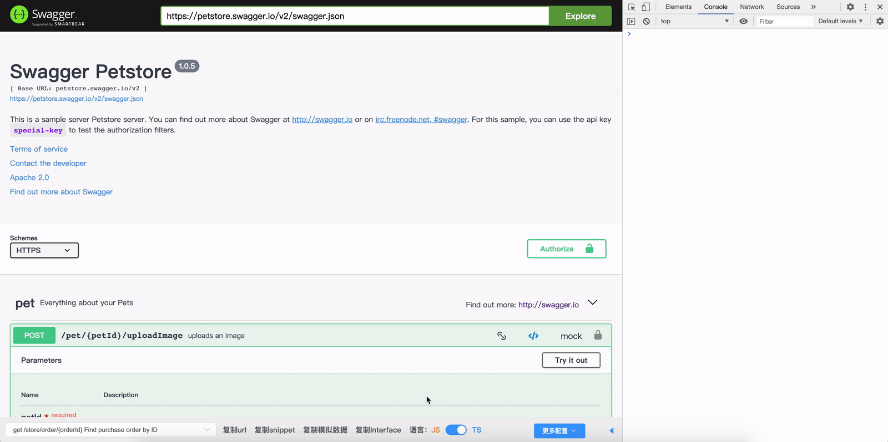

# free-swagger-extends

根据 swagger 文档自动生成前端接口代码片段

free-swagger-extends 基于 [free-swagger-client](https://www.npmjs.com/package/free-swagger-client) 开发的油猴脚本，增强浏览器端对于 swagger 文档的处理行为

下方的操作栏即 free-swagger-extends 提供的扩展能力

# 功能介绍

##  api 搜索

## 复制 api 代码片段

## 复制/递归复制 interface/typedef

## 复制 api  路径	

## 复制 mock 数据

## 复制全量 typedef

## 复制全量 interface 

# 安装 & 使用

free-swagger-extends 是基于 UserScript 用户脚本拓展插件 (跨平台的浏览器插件)开发的脚本工具. 因此使用前, 我们需要安装浏览器插件 Tampermonkey

## 安装油猴插件

在 chrome 的拓展工具中心搜索关键字 [Tampermonkey](https://chrome.google.com/webstore/detail/tampermonkey/dhdgffkkebhmkfjojejmpbldmpobfkfo)

安装完成后, 浏览器状态栏应该会出现一个图标

## 安装 free-swagger-extends

安装方式统一为引入 url 安装

脚本地址：https://cdn.jsdelivr.net/npm/free-swagger-extends/dist/userScript.js

具体操作方式如下

## 使用

进入包含 `swagger`字段的网页， 你就会发现 Tampermonkey 图标亮了, 有一个小图标表示它在当前网页上注入了一个脚本

这时你会在网页下放发现多了一个操作栏, 祝贺您获得了 swagger-ui 的拓展能力.

## 匹配更多网址

油猴脚本通过脚本中 `@include` 字段判断当前网页是否需要注入脚本

添加 `@include` 字段，使得脚本匹配更多网址

至此，当访问网址包含 `swagger` / `other-url` 时，就会注入 free-swagger-exntends 脚本

## 更新

点击设置，勾选检查更新，输入更新 url https://cdn.jsdelivr.net/npm/free-swagger-extends/dist/userScript.js 即可收到脚本更新消息

# 编辑模版

free-swagger-extends 基于 free-swagger-client，通过模版生成代码片段

默认使用 axios 作为模版，生成的代码片段如下

通过编辑模版，可以自定义生成的代码片段，通过改变入参位置、切换请求库名来适配任意请求库的结构

例如将 axios.request 改成 request，示例如下

模版函数接受多个参数，可以自由组合成想要的代码片段，详细使用方式参考 [free-swagger-client](https://www.npmjs.com/package/free-swagger-client)
